### Meeting 03/20/2026
#### Discussions
- 1. Use the WEIGHT column in the model to adjust data close to the population?

The weight tells you:
How many people in the U.S. population this respondent represen ts. So instead of treating every observation equally, you scale them.
Example:
Respondent A: weight = 500
Respondent B: weight = 2,000
👉 B represents 4× more people than A in the population.

```{R}
#| eval: false
lm(Y ~ X1 + X2, data = df, weights = weight)
```

**Discussion:**

- 2. There are multiple questions indicting similar metrics such as age, education, region, financial condition, income, employment status. Sync across memebers which ones to use.

**Discussion:**

- 3. Shall we add up multiple total monthly payment variables to get the total monthly payment measure? (rental + loans + other)

**Discussion:**

- 4. Which variable to use as retirement_flag? (D22_i, D1i)

**Discussion:**

- 5. Which variable to use as credit health? (A6, ppfs1482, A1_abc)

**Discussion:**

- 6. Which variable to use as financial situation (better or worse) ?

**Discussion:**

- 7. Which variable to use education level? (ED0, ppeduc5)

**Discussion:**

- 8. Which variable to use as Race?
**Discussion:**

- 9. income amt? (ppinc7, I40)
**Discussion:**

#### EDA
 - 1. Relationship with BNPL usage:

| Variable   | Question | Category | Correlation with BNPL1 | Spearman corr (p) | Chi^2 (p, cramers_v) |
|--------|-----|-----|-----|-----|-----|
| B3  | financial health | | Y | -0.183 (5.55e-93) | 424(1.07e-91, 0.186) |
| X12_abcdefg | financial concern flag | | |
| ppgender | gender | | N | |
| CG2 | weekly Childcare expense | monthly payment | |
| SL4 | monthly student loan payment | monthly payment | |
| M4 | monthly mortgage payment | monthly payment | |
| I40 | 12 months personal income amt | income amt | |
| D22_i, D1i | retired flag|  | N | | |
| R1_abcdefgh | renting house flag | | N | |
| A6  | credit application confidence | | Y | -0.21 (1.137e-124) | |
| A1_abc | credit card application challenge | | Y | | 336.75	(3.26e-75,	0.286) |
| AB_abcdef | loan/credit card application failure flag | | N | | |
| C4A | credit card default frequency | | Y | 0.273	(1.314e-176) | |
| SL6 | student loans default flag | | N | | |
| EF5C | Bill default flag | | N | | |
| SL4A | student loan flag | | N | | |
| ppemploy | employment flag | | N | | |
| ED0| education | | N | | |
| I0_abcdef | Income flag | | N | | |
| INF4 | financial health | | N | | |
| I9 | income statbility | | N | | |
| I21_a | income increase flag | | N | | |
| I21_b | spending increase flag | | N | | |
| ppage | age | | Y | -0.144 (4.917e-58) | |
| ppagecat | age | | Y |  | |
| ppethm, ppracem, pphispan | race | | N | | |
| ppmarit5 | marital status | |  N | | |
| EF1 | emergency fund flag | | Y | | 393.63(1.336e-87,	0.179) |
| ppfs1482 | credit score | | Y | | 676.18 (6.923e-144,	0.263416) |
| ppinc7 | household income | | N | | |
| SL3 | total student loans amt | | N | | |
| BNPL1 | BNPL flag | | |
| BNPL3 | BNPL default | | |
| BNPL4_abcdefg | BNPL reason | | |
| R3 | monthly rental expense paid by parent/spouse/partner/self | | |

{width=50%, fig-align="left"}
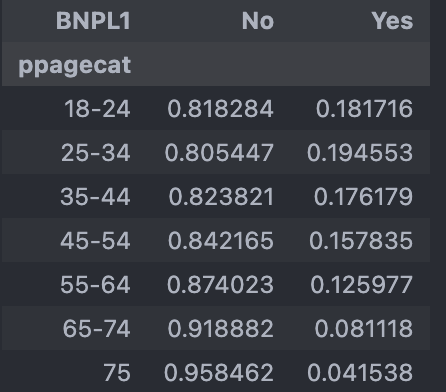{width=50%, fig-align="left"}
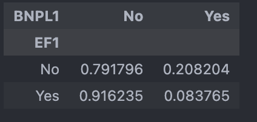{width=50%, fig-align="left"}
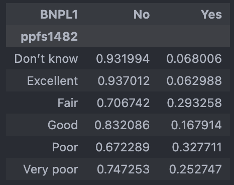{width=50%, fig-align="left"}

 - 2. Relationship with BNPL default:

| Variable   | Question | Category | Correlation with BNPL1 | Spearman corr (p) | Chi^2 (p, cramers_v) |
|--------|-----|-----|-----|-----|-----|
| B3  | financial health | | Y | -0.183 (5.55e-93) | 88.75 (4.052e-19, 0.23) |
| X12_abcdefg | financial concern count | Y | | 42.23	(4.690e-07,	0.2287) |
| X12_abcdefg | financial concern score | Y | | 57.69	(2.964e-07,	0.2671) |
| ppgender | gender | | N | |
| CG2 | weekly Childcare expense | monthly payment | |
| SL4 | monthly student loan payment | monthly payment | |
| M4 | monthly mortgage payment | monthly payment | |
| I40 | 12 months personal income amt | income amt | |
| D22_i, D1i | retired flag|  | N | | |
| R1_abcdefgh | renting house flag | | N | |
| A6  | credit application confidence | |  |  | |
| A1_abc | credit card application challenge | | Y | 102.44	(4.443e-24,	0.33) | |
| AB_abcdef | loan/credit card application failure flag | | N | | |
| C4A | credit card default frequency | | Y | 0.273	(1.314e-176) | |
| SL6 | student loans default flag | | N | | 41.289 (1.31e-10	0.313) |
| EF5C | Bill default flag | | Y | | 103.721 (2.328e-24,	0.249) |
| SL4A | student loan flag | | N | | |
| ppemploy | employment flag | | N | | |
| ED0| education | | N | | |
| I0_abcdef | Income flag | | N | | |
| INF4 | financial health | | N | | |
| I9 | income statbility | | N | | |
| I21_a | income increase flag | | N | | |
| I21_b | spending increase flag | | N | | |
| ppage | age | | Y | -0.144 (4.917e-58) | |
| ppagecat | age | | Y |  | |
| ppethm, ppracem, pphispan | race | | N | | |
| ppmarit5 | marital status | |  N | | |
| EF1 | emergency fund flag | | Y | | 393.63(1.336e-87,	0.179) |
| ppfs1482 | credit score | | Y | | 676.18 (6.923e-144,	0.263) |
| ppinc7 | household income | | Y | | 101.90 (1.00e-19,	0.247) |
| SL3 | total student loans amt | | N | | |
| BNPL1 | BNPL flag | | |
| BNPL3 | BNPL default | | |
| BNPL4_abcdefg | BNPL reason | | |
| R3 | monthly rental expense paid by parent/spouse/partner/self | | |

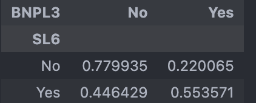{width=50%, fig-align="left"}
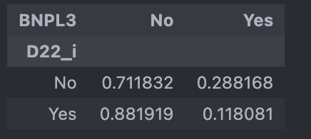{width=50%, fig-align="left"}
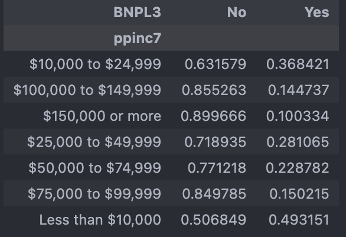{width=50%, fig-align="left"}
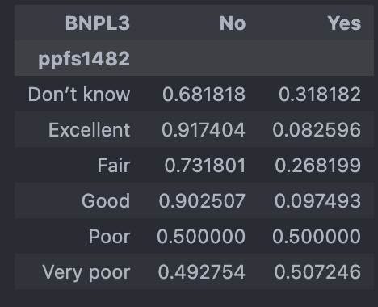{width=50%, fig-align="left"}


### Meeting 03/27/2026
#### Discussions
- 1. Use the WEIGHT column in the model to adjust data close to the population?

The weight tells you:
How many people in the U.S. population this respondent represen ts. So instead of treating every observation equally, you scale them.
Example:
Respondent A: weight = 500
Respondent B: weight = 2,000
👉 B represents 4× more people than A in the population.

```{R}
#| eval: false
lm(Y ~ X1 + X2, data = df, weights = weight)
```


- 2. Questions to answer

2.1. Describe BNPL users characteristics. Compare with those not. Descriptive plots (multi-dimensional scatter plot), crosstab, corr heatmap.

2.2. Describe BNPL default users characteristics. Compare with those not. Descriptive plots (multi-dimensional scatter plot), crosstab, corr heatmap.

2.3 Regression model to predict BNPL use or not. Cross validation. Accuracy. Significant predictors? Model reduction. Add regularization.

2.4 Regression model to predict BNPL default. Cross validation. Accuracy. Significant predictors? Model reduction. Add regularization.

2.5 SVC/SVM? support vector machine.


#### High correlation columns
 - 1. With BNPL1:

| Variable | Question | Category | Correlation with BNPL1 | Spearman corr (p) | Chi^2 (p, cramers_v) |
|--------|-----|-----|-----|-----|-----|
| ppfs0596	| Household income and investment | | | -0.157546	(2.101884e-168) | 785.899053	(1.714126e-166,	0.157056)  |
| ppfs1482 | Where do you think your credit score falls? |  |  | | 2095.860225	(0.000000e+00,	0.228806)|
| ppage | age |  |  | -0.129598	(5.249315e-176) | |
| A6 | Confidence of credit card application approval | |  | | 1807.429243	(0.000000e+00	0.195611)|
| C4A | Frequency carried an unpaid balance on credit cards | |  | | 2409.108407	(0.000000e+00	0.244392V)|
| EF1 | Have you set aside emergency funds? | | |  | 1395.318197(2.186735e-305	0.171870)|
| A1_a | Turned on for credit in past 12 months | |  | | 1028.181904	(1.344683e-225	0.249273)|
| A1_b| Approved for credit, but were not given as much credit as you applied for in the past 12 months | | | | 774.527515	(1.863587e-170	0.216351)|
| A1_c | Put off applying for credit because you thought you might be turned down in the past 12 months |  |  | | 954.507724	(1.389561e-209	0.240176) |
| X12_e | Making ends meet - Are each of the following a financial challenge or concern for you or your family? | |  | | 228.753785	(2.122007e-50	0.193255) |
| ppfs1482_Excellent  | where do your credit score falls? |  | |  | 1413.792239	(2.115226e-309	0.173004) | |
| C4A_Most_or_all_of_the_time	 | In the past 12 months, how frequently have you carried an unpaid balance on one or more of your credit cards?  | |  | | 1511.582349	(0.000000e+00	0.178887) |
| C4A_Never carried an unpaid balance (always paid in full) | In the past 12 months, how frequently have you carried an unpaid balance on one or more of your credit cards? | |  | | 1857.842534	(0.000000e+00	0.198321)|


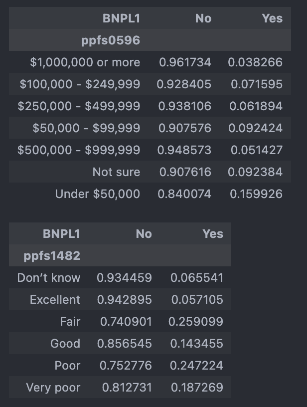{width=50%, fig-align="left"}
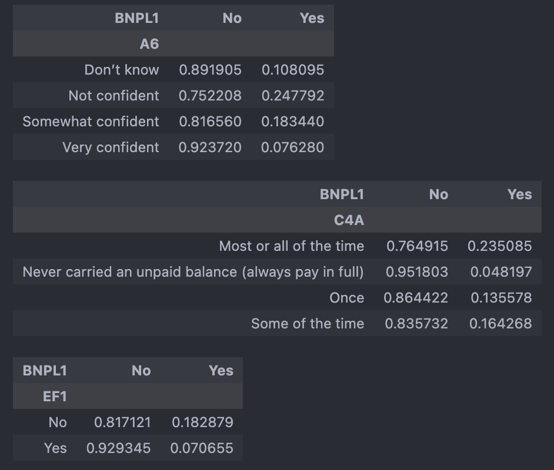{width=50%, fig-align="left"}
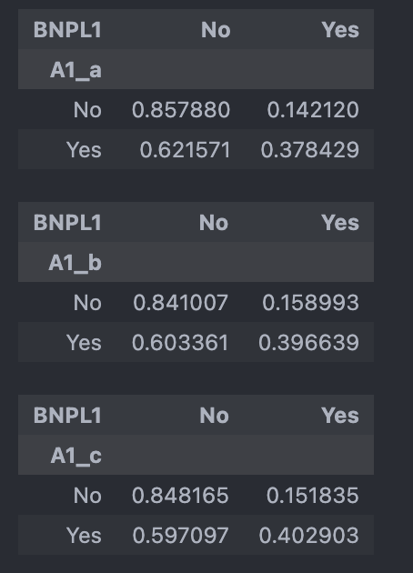{width=50%, fig-align="left"}
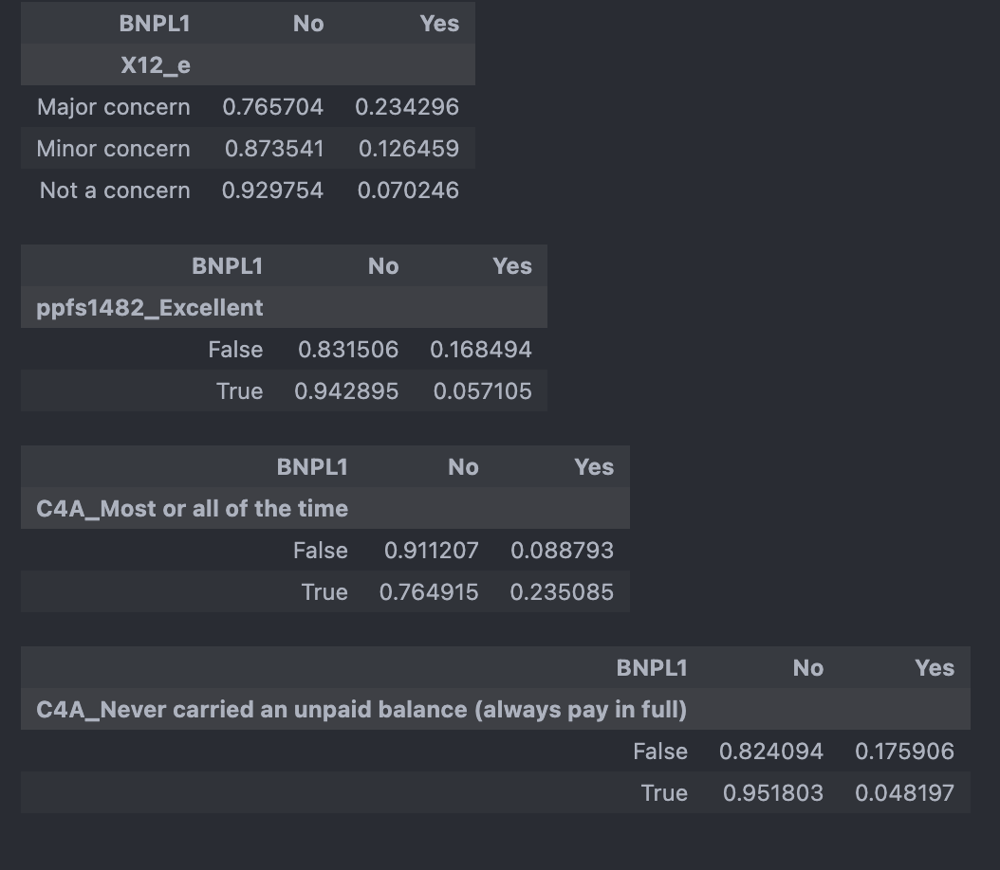{width=50%, fig-align="left"}


 - 2. With BNPL3:

| Variable | Question | Category | Correlation with BNPL1 | Spearman corr (p) | Chi^2 (p, cramers_v) |
|--------|-----|-----|-----|-----|-----|
| I20	| Spending higher/lower/same as income | | | | 153.998819	(3.627283e-34	0.167164)  |
| ppeducat	| Education | | |  | 127.669360	(1.719082e-27	0.152205)  |
| ppfs0596	| Household income and investment | | |  | 785.899053	(1.714126e-166,	0.157056)  |
| ppinc7 | Household income |  |  | -0.206426	(4.186553e-54) | 248.637921	(8.016644e-51	0.212407)|
| ppfs1482 | Where do you think your credit score falls? |  | |  | 414.660244	(2.051954e-87	0.309423) | |
| SL6 | Are you behind on payments or in collections for one or more of the student loans from your own education?  | |  | | 109.305151	(1.391303e-25	0.268339) |
| A6 | Confidence of credit car approval | |  | | 527.580377(5.026688e-114	0.309406) |
| EF1 | Have you set aside emergency funds? | | |  | 141.565359	(1.210373e-32	0.160274)|
| A1_a | Turned on for credit in past 12 months | |  | | 293.640910	(8.002979e-66	0.301094)|
| A1_b| Approved for credit, but were not given as much credit as you applied for in the past 12 months | | | | 103.896530	(2.131625e-24	0.179100)|
| A1_c | Put off applying for credit because you thought you might be turned down in the past 12 months |  |  | | 223.091585	(1.914480e-50	0.262444) |
| X12_a | Finding or keeping a job - Are each of the following a financial challenge or concern you or your family?  | |  | | 54.618626	(1.379482e-12	0.260156) |
| X12_c | Increases in prices for things you buy - Are each of the following a financial challenge concern for you or your family?  | |  | | 28.956009	(5.155639e-07	0.189423) |
| X12_e | Making ends meet - Are each of the following a financial challenge or concern for you or your family? | |  | | 51.299939	(7.250364e-12	0.252128) |
| EF5C	 | Other than any credit card bills you may have, did you pay all your bills in full last month?   | |  | | 230.371682	(4.946355e-52	0.271512) |
| ppfs1482_Excellent | Excellent credit scores | |  | | 127.502275	(1.442355e-29	0.152105)|
| ppfs1482_Poor | Poor credit scores | |  | | 164.054165	(1.472072e-37	0.172535)|


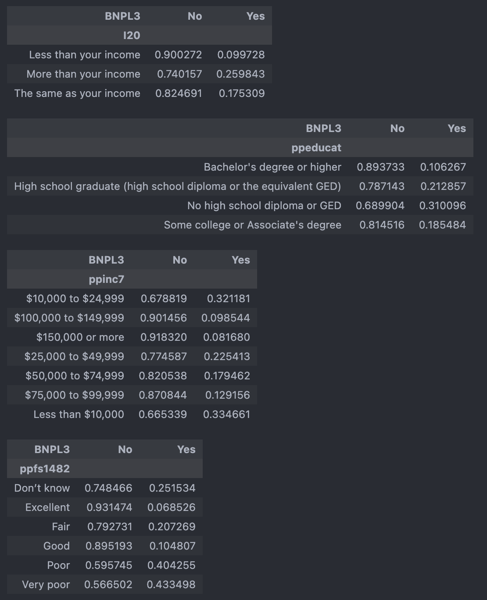{width=50%, fig-align="left"}
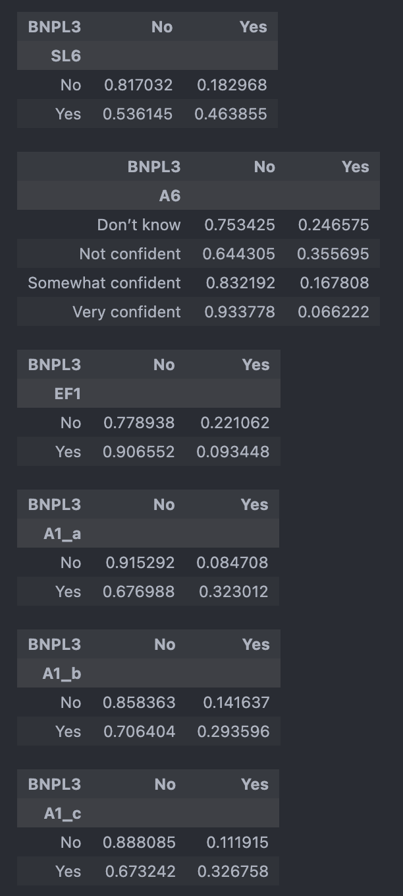{width=50%, fig-align="left"}
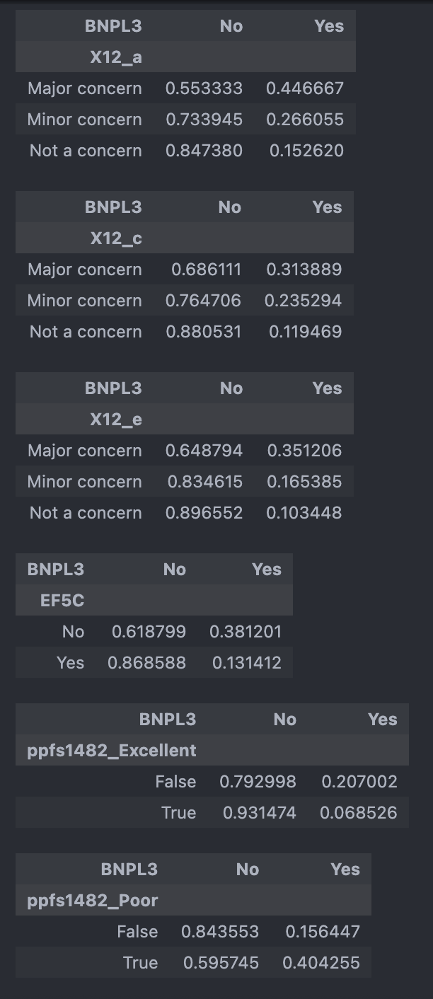{width=50%, fig-align="left"}
