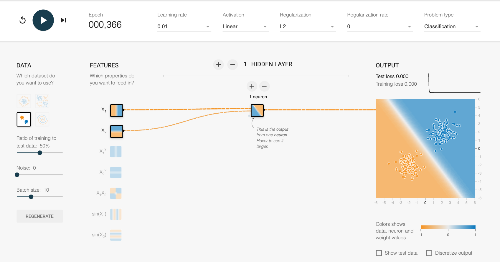

## Part-2: R

Complete the exercises below in an `.rmd` file.

### Q-2.1

Explore the web-application found at the following link

**Q-2.1.a** Use the training dataset where the two classes are easily separable, i.e. with two separated blobs in the upper and lower left quadrant. Train your model. How well does your classifier do? Provide a screenshot of the result.

[click here](https://playground.tensorflow.org/#activation=tanh&batchSize=10&dataset=circle&regDataset=reg-plane&learningRate=0.03&regularizationRate=0&noise=0&networkShape=4,2&seed=0.62835&showTestData=false&discretize=false&percTrainData=50&x=true&y=true&xTimesY=false&xSquared=false&ySquared=false&cosX=false&sinX=false&cosY=false&sinY=false&collectStats=false&problem=classification&initZero=false&hideText=false)

Use the playground to create an architecture for logistic regression for binary classification. We'll have two inputs and one output.

**Q-2.1.b** What are your fitted weights? Use those weights to compute (by hand) what the predicted probability for two arbitrary sample points, verify your intuition.
